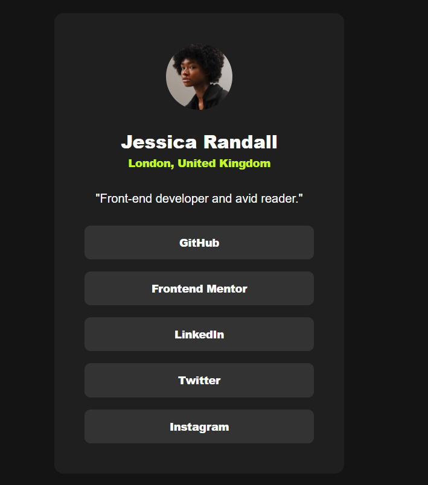

 Frontend Mentor - Social links profile solution

This is a solution to the [Social links profile challenge on Frontend Mentor](https://www.frontendmentor.io/challenges/social-links-profile-UG32l9m6dQ). Frontend Mentor challenges help you improve your coding skills by building realistic projects. 

## Table of contents

- [Overview](#overview)
  - [The challenge](#the-challenge)
- [My process](#my-process)
  - [Built with](#built-with)

**Note: Delete this note and update the table of contents based on what sections you keep.**

## Overview



### The challenge

Users should be able to:

- See hover and focus states for all interactive elements on the page

## My process

### Built with

- Semantic HTML5 markup
- CSS custom properties
- Flexbox
- Mobile-first workflow

### What I learned

#### Links must be `<a>` elements

Interactive elements that navigate somewhere must use `<a href="...">`, not `<div>` or other non-interactive elements. Using `<div>` for links breaks:

- Keyboard navigation (not focusable by default)
- Screen readers (won't announce as interactive)
- Right-click / open in new tab behaviour

```html
<!-- Bad -->
<div class="profile-link">GitHub</div>

<!-- Good -->
<a href="https://github.com/username" target="_blank" rel="noopener noreferrer">GitHub</a>
```

Always add `rel="noopener noreferrer"` when using `target="_blank"` — it prevents the opened page from accessing your page via `window.opener`.

#### BEM Naming

BEM structure: `block__element--modifier`

- `__` (double underscore) = element of a block
- `--` (double dash) = modifier of a block or element
- Single hyphen for multi-word element names: `profile__links-item` not `profile__links--item`

Common mistakes:

```css
/* Bad — using -- for an element, not a modifier */
.profile__card--about { }
.profile__info--name { }

/* Good — these are elements, not modifiers */
.profile__about { }
.profile__name { }

/* Bad — single underscore is not valid BEM */
.profile_links--list { }

/* Good */
.profile__links { }
.profile__links-item { }
```


#### Zero values don't need units

```css
/* Unnecessary */
padding: 0px;
margin: 0px;

/* Correct */
padding: 0;
margin: 0;
```

#### Put interactive styles on the interactive element

Hover and focus styles belong on the element that receives focus — the `<a>` tag, not its parent `<li>`.

```css
/* Bad — <li> is not focusable */
.profile__links-item:hover { }

/* Good — <a> is the interactive element */
.profile__links-item a:hover,
.profile__links-item a:focus-visible { }
```

Alternatively, put the BEM class directly on the `<a>`:

```html
<li><a class="profile__links-item" href="#">GitHub</a></li>
```

Then style `.profile__links-item` directly.

#### Keyboard focus styles are mandatory

Every interactive element needs a visible `:focus-visible` style. Without it, keyboard users can't see which element is active.

```css
.profile__links-item:hover,
.profile__links-item:focus-visible {
    color: var(--gray-700-color);
    background-color: var(--green-color);
    outline: none; /* safe to remove since background change is visible */
}
```

Use `:focus-visible` rather than `:focus` — it only fires during keyboard navigation, not on mouse clicks (which would cause a distracting flash).

For custom focus rings:

```css
.card__link:focus-visible {
    outline: 3px solid var(--gray-950-color);
    outline-offset: 3px;
    border-radius: 2px;
}
```

#### Responsive width without a media query

Instead of a fixed width plus a breakpoint override, use `min()` to handle both cases in one line:

```css
/* Card is 384px wide, or full width minus 24px padding on each side — whichever is smaller */
.profile__card {
    width: min(384px, calc(100% - 48px));
}
```

#### Responsive padding — tie breakpoint to card width

When the card reaches its maximum width (384px), the viewport must be at least `384 + 48 = 432px` wide (card width plus horizontal margins). Use that as the breakpoint so the logic stays coherent:

```css
/* Base — mobile */
.profile__card {
    padding: var(--space-6); /* 24px */
}

/* Card is full width — switch to desktop padding */
@media (min-width: 432px) {
    .profile__card {
        padding: calc(var(--space-5) * 2); /* 40px */
    }
}
```

Avoid using a device pixel width (375px) as a breakpoint for a design value — they will collide at that exact width.


#### Commit to rem or px — don't mix them

The `html { font-size: 62.5% }` trick exists so you can write `1.6rem` instead of `16px`. If you set that up, use `rem` everywhere for consistency:

```css
/* If using 62.5% base */
.profile__name    { font-size: 2.4rem; } /* = 24px */
.profile__about   { font-size: 1.6rem; } /* = 16px */
.profile__location { font-size: 1.4rem; } /* = 14px */
```

Mixing `rem` and `px` in the same project loses the benefit of either approach.

#### dvh with vh fallback

`100dvh` accounts for mobile browser chrome (address bar height); `100vh` does not. Use both so older browsers get a working fallback:

```css
main {
    min-height: 100vh;   /* fallback: browsers without dvh support */
    min-height: 100dvh;  /* preferred: accounts for mobile browser chrome */
}
```

Browsers read top to bottom — if they understand `dvh` they apply it, otherwise the `vh` value already applied stays.

#### list-style: none belongs on the parent

Set it once on the `<ul>` rather than repeating it on every `<li>`:

```css
.profile__links {
    list-style: none;
}
```
#### Accessibility: Keyboard navigation requires focusable, styled elements

- Only use `:hover` on elements that are also keyboard-focusable
- Every `:hover` state should have a matching `:focus-visible` state
- `<div>` and `<li>` are not focusable by default — put interactive styles on `<a>` or `<button>`

